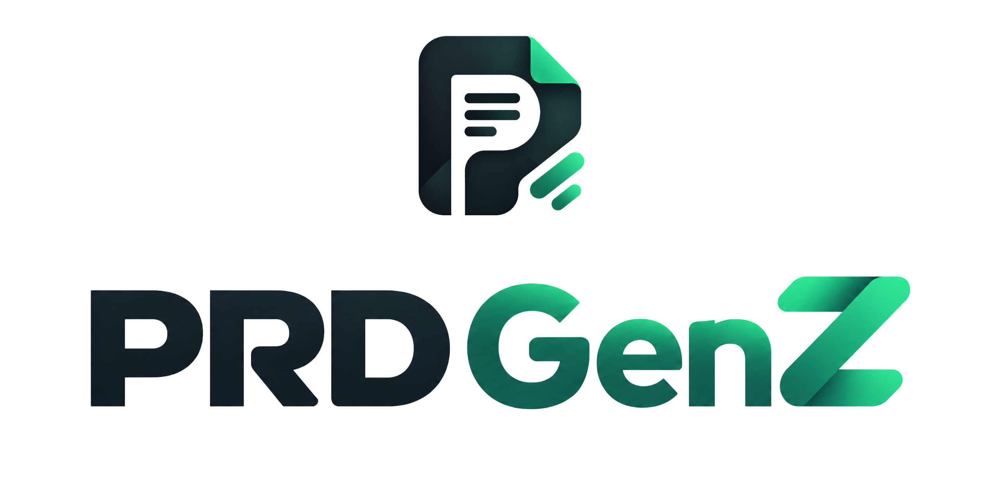

<div align="center">



[](https://nextjs.org)
[](https://www.typescriptlang.org)
[](LICENSE)

AI-powered PRD Generator — generate professional PRDs for AI coding assistants (Cline, Cursor, Lovable, etc.)

</div>

## Features

- **Create from Scratch** — step-by-step guided PRD creation
- **Chat Mode** — conversational AI assistant that clarifies your idea
- **One-Shot Mode** — single input, full PRD output
- **Multi-Provider AI** — OpenAI, Anthropic, Google, OmniRoute, TokenRouter, 9Router
- **BYO API Keys** — bring your own keys (cloud: encrypted at rest; self-host: stored locally)
- **Multi-Language** — Indonesian & English PRD output
- **Export** — Markdown & PDF
- **Versioning** — auto-saved PRD versions
- **Self-Host** — single-user, local SQLite, no account required
- **Cloud** — auth, projects, sharing, Free/Pro plans

## Project Structure

```
prdgenz/
├── apps/
│   ├── cloud/          # SaaS application (Next.js + Prisma + PostgreSQL)
│   └── self-host/      # Self-hosted application (Next.js + Prisma + SQLite)
├── packages/
│   ├── shared/         # Shared types, constants, prompts, AI providers, templates
│   └── ui/             # Shared UI components
├── package.json
├── pnpm-workspace.yaml
└── turbo.json
```

## Getting Started

### Prerequisites

- Node.js >= 20
- pnpm >= 9

### Installation

```bash
pnpm install
```

### Development

```bash
# Run all apps (cloud :3000, self-host :3001)
pnpm dev

# Run a specific app
pnpm --filter @prdgenz/cloud dev
pnpm --filter @prdgenz/self-host dev
```

### Database

```bash
# Cloud (PostgreSQL — set DATABASE_URL in apps/cloud/.env first)
pnpm --filter @prdgenz/cloud db:push

# Self-host (SQLite — auto-created at apps/self-host/prisma/prdgenz.db)
pnpm --filter @prdgenz/self-host db:push
```

### Build

```bash
pnpm build
```

## Self-Host via Docker

```bash
cd apps/self-host/docker
cp ../.env.example .env   # fill in at least one *_API_KEY
docker compose up -d       # app on http://localhost:3000
```

Data (SQLite) persists in the `prdgenz-data` volume.

## Cloud Deploy

Deploy the `apps/cloud` directory to Vercel, Railway, or Render.

## Documentation

See the [User Guide](docs/USER_GUIDE.md) for:
- Getting started (cloud & self-host)
- BYOK — configuring AI provider keys
- All environment variables
- Troubleshooting

## Testing

```bash
pnpm test          # all packages (vitest via turbo)
```

## License

MIT
